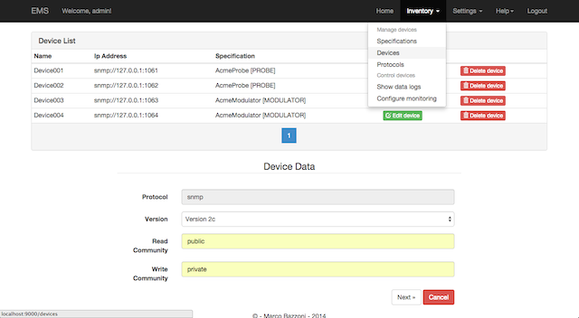
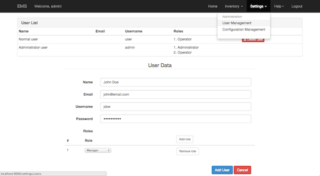

# EMS - Enterprise Monitoring System

## Java Web Application - SCADA / HMI server

### Overview
In systems engineering, a system monitor (SM) is a process within a distributed system for collecting and storing state data. **Network monitoring** or more simply monitoring is the use of a system that constantly monitors a computer or a device for slow or failing components and that notifies the administrator. The **Internet of Things (IoT)** refers to the interconnection of uniquely identifiable embedded computing-like devices within the existing Internet infrastructure. 

### Project scope
Project scope is creating an application that can monitor remote devices with different protocols. Application offers easly customizable dashboard, a pluggable and extensible data model, advanced configuration functionalities.

#### Dashboard
Application home page is a dashboard, each user can customize its widgets position and layout.  


Dashboard is a drill-down, straight-forward access point to remote device information, in order to allow operator reach the most important information in the fastest way. 

#### Data model
Application data model is pluggable and extensible each device is easly described by the notion of driver. The driver is, somehow, the hardware description of remote device. In the driver it is described the feature list of the device that has to be monitored.

For example let's suppose we want to define a RF modulator we can prepare a JSON file that will be our new driver like this:
```JSON
{
    "type":"object",
    "title":"Modulator",
    "javaInterfaces" : ["ems.driver.domain.Driver"],
    "javaType": "ems.driver.domain.modulator.ModulatorDriver",
    "properties":{
        "status":{
            "$ref": "status.json"
        },
        "type" : {
            "$ref": "driver_type.json"
        },
        "power":{
            "title":"Power",
            "type":"number"
        },
        "reflected-power":{
            "title":"Reflected power",
            "type":"number"
        },
        "nominal-power":{
            "title":"Nominal power",
            "type":"integer"
        },
        "location":{
            "$ref": "location.json"
        },
        "alarm":{
            "title":"Alarm",
            "type":"boolean"
        }
    },
    "additionalProperties": false
}
```
The driver must be compliant to [JSON Schema and Hyper-Schema specification](http://json-schema.org/). For futher information please referer to [EMS Extension project](https://github.com/thebaz73/ems-extension).

Once the driver is defined and imported into the application the user will be allowed to add information for each feature defined into the driver as in following screenshot.


Please note that each property defined in the driver specification can be "scripted" using Javascript. Infact once the property value is retrieved from the remote device a javascript code is executed in order to accomplish some custom operations. To explain better please follow this exmaple. Suppose, again, that the user purpose is monitoring a RF Modulator, he can "normalize" the power value using following code the converts the value in percentage value:

```javascript
var power = function(context) {
    return (context.power / context.nominalPower) * 100;
}
```
**IMPORTANT:** Javascript code is syntactically checked.

The same solution is adopted for protocol configuration. Let's consider [SNMP](http://en.wikipedia.org/wiki/Simple_Network_Management_Protocol) which is actually integrated (other protocols to be integrated according to the plan are [JMX](http://docs.oracle.com/javase/8/docs/.../jmx/JMX_1_4_specification.pdf) and [MODBUS](http://www.modbus.org/specs.php)).

```JSON
{
    "type":"object",
    "title":"SNMP Protocol",
    "javaInterfaces" : ["ems.protocol.domain.Protocol"],
    "javaType": "ems.protocol.domain.snmp.SnmpProtocol",
    "properties":{
        "protocolType":{
            "title":"ProtocolType",
            "javaType": "ems.protocol.domain.ProtocolType",
            "type":"string",
            "enum":[ "snmp", "jmx", "modbus" ],
            "default": "snmp"
        },
        "version":{
            "title":"Version",
            "type":"string",
            "enum":[ "version 1", "version 2", "version 2c" ]
        },
        "readCommunity":{
            "title":"Read Community",
            "type":"string"
        },
        "writeCommunity":{
            "title":"Write Community",
            "type":"string"
        }
    },
    "additionalProperties": false
}
```

And again the application UI adaptes to the specification



#### Configuration



### Technology
 * Java
 * Spring (Core, Security, Data)
 * Restful Web Services
 * Javascript & HTML5
 * JSON & JSON Schema
 * MongoDB

### Status & Notes
Project is still in its early stages.

### Demo
Planned...
